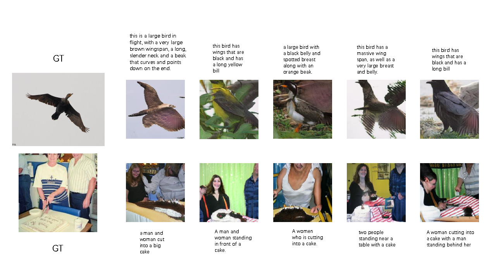
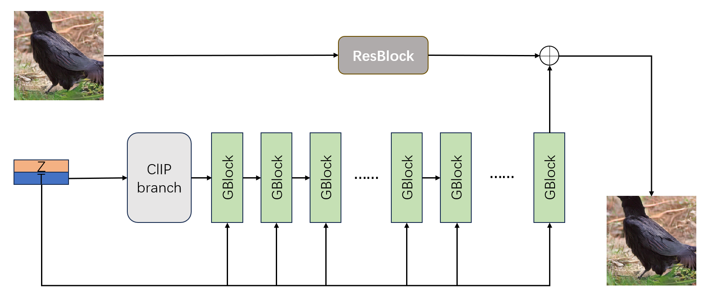
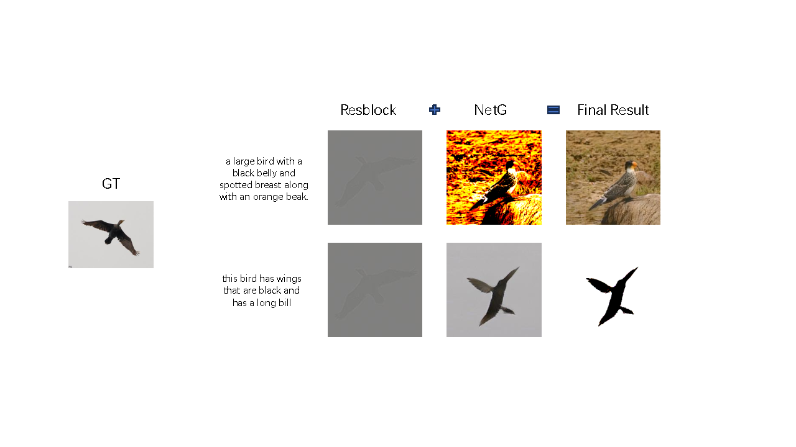
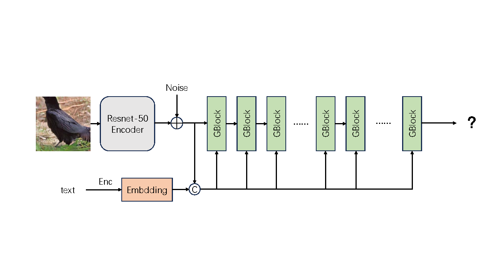

# Replication of CVPR 2023 paper : GALIP: Generative Adversarial CLIPs for Text-to-Image Synthesis

Replication made by individuals for paper [GALIP: Generative Adversarial CLIPs for Text-to-Image Synthesis](https://arxiv.org/abs/2301.12959) by [Ming Tao](https://scholar.google.com/citations?user=5GlOlNUAAAAJ), [Bing-Kun Bao](https://scholar.google.com/citations?user=lDppvmoAAAAJ&hl=en), [Hao Tang](https://scholar.google.com/citations?user=9zJkeEMAAAAJ&hl=en), [Changsheng Xu](https://scholar.google.com/citations?user=hI9NRDkAAAAJ). 

## Performance
**Training was carried out only on the premise of a single GPU and a reduced batchsize. The following results are individual replication only**

### Quantitative results

| Dataset |    Model   |     FID↓    |   CLIPSIM↑   |  TOPIQ(NR)↑  |     SSIM↑    |    LPIPS↓    |
|:------:|:---------:|:----------:|:-----------:|:-----------:|:-----------:|:-----------:|
|  birds |  800epoch |   23.17    |   0.3152    | **0.6241** | **0.0229** |   0.7533    |
|  birds | 1500epoch |   23.99    | **0.3180** |   0.6219    |   0.0219    | **0.7375** |
|  birds |   Paper   | **10.08** |   0.3164    |      -      |      -      |      -      |
|  coco  |  150epoch |   10.11    |   0.3198    |   0.5986    | **0.0254** |   0.7567    |
|  coco  |  300epoch |    8.49    |   0.3282    |   0.5933    |   0.0240    | **0.7487** |
|  coco  |  400epoch |    8.37    |   0.3274    |   0.5961    |   0.0229    |   0.7493    |
|  coco  |  Released |  **5.11** | **0.3377** | **0.6269** |   0.0233    |   0.7515    |
|  coco  |   Paper   |    5.85    |   0.3338    |      -      |      -      |      -      |

It is worth mentioning that on both datasets, near the end of training, the training process crashes, when we train on a single gpu and set the batchsize to 32.

### Qualitative results

Here are the results based on different textual descriptions of the same image.The generated result has little to do with the original image, except for the semantic correlation. It can be seen that the model successfully learns the text-to-image distribution mapping

<b>Generated Images

    

On the other hand, we find that the generation capacity of this GAN model was limited, there were distortions in shape, and the color representation was not rich enough.

## Additional explorations

In this section, we conducted two exploratory experiments.
### Residual structure
The original generator is used as a residual branch of image processing.We hope to produce results that are close to the original image.

    

However, the results show that the residual block learns almost nothing, and the output of this module accounts for less than one percent of the final result.

    

### Replace noise
We add the  Gaussian noise to image features the and make the results still obey a Gaussian normal distribution.In this way, the input noise is mixed with the distribution of the original image.It will be interesting to see what the model will generate.Unfortunately, the model training was unstable and ultimately unsuccessful.

    

## Requirements
- python 3.9
- Pytorch 1.13
- 1x12GB 1080 GPU or 1x16GB V100 GPU or 1x24GB 3090 GPU (for training)

For other dependency requirements, please refer to Dockerfile

## Installation

Clone this repo.

Compile the Dockfile and use the image.

## Datasets Preparation
Follow the author's instructions
1. Download the preprocessed metadata for [birds](https://drive.google.com/file/d/1I6ybkR7L64K8hZOraEZDuHh0cCJw5OUj/view?usp=sharing) [coco](https://drive.google.com/file/d/15Fw-gErCEArOFykW3YTnLKpRcPgI_3AB/view?usp=sharing) and extract them to `data/`
2. Download the [birds](http://www.vision.caltech.edu/visipedia/CUB-200-2011.html) image data. Extract them to `data/birds/`
3. Download [coco2014](http://cocodataset.org/#download) dataset and extract the images to `data/coco/images/`

## How to use
  - For trianing: `bash scripts/train.sh`
  - For evaluation: `python src/metric_cal.py`
  - For sampling: `python src/sampledemo.py`

## pretrained_model_path

The pretrained ckpts released by author are available at [[code]](https://github.com/tobran/GALIP)

Our training crashed near the end, so we only offered a version with fewer epoch:[[birds_state_epoch_800]](https://rec.ustc.edu.cn/share/292eeed0-50ca-11ef-bbce-bd50e03f7d70)(password:5g06)
[[coco_state_epoch_400]](https://rec.ustc.edu.cn/share/58e65790-50ca-11ef-b8f7-edb4293ae45a)(password:af1m)

## Reference
- [GALIP: Generative Adversarial CLIPs for Text-to-Image Synthesis (CVPR 2023)](https://arxiv.org/abs/2301.12959) [[code]](https://github.com/tobran/GALIP)